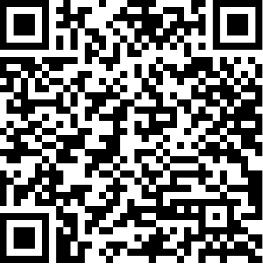

# W-Health

## Project Overview

W-Health is a comprehensive healthcare app designed to empower women in navigating their healthcare journey. Our solution includes features like a supportive forum for sharing experiences, an intelligent AI assistant providing personalized health guidance, a convenient doctor-finding tool, and an educational hub offering comprehensive health information. The goal is to foster a community-driven approach to women's health and well-being, breaking down barriers and promoting gender equality in healthcare.

## Problem Statement

W-Health addresses significant barriers obstructing women's access to essential healthcare information and services. Limited access, stigma, and taboos surrounding women's health topics hinder informed decision-making and timely medical assistance, perpetuating disparities in health outcomes. The app aims to empower women by providing knowledge, support, and access to healthcare professionals, with a specific focus on young girls who face additional challenges due to a lack of health education.

## Sustainable Development Goals

Our project aligns with United Nations' Sustainable Development Goal 5: Gender Equality, focusing on targets 5.6.1 and 5.6.2 for women's decision-making autonomy in healthcare and equal access to sexual and reproductive health services. Additionally, we contribute to Goal 3: Good Health and Well-being, targeting 3.1.1 and 3.3.1 to reduce maternal mortality and end the AIDS epidemic.

    
    

## Technical Architecture

### Components
- **Frontend:** Flutter for a cross-platform, responsive user interface.
- **Backend:** Firebase for well-organized databases and real-time synchronization.
- **AI Chatbot:** Gemini for personalized health guidance.
- **Location Services:** Google Maps API for doctor-finding and user location.

    
    
    
    

### Products and Platforms
- **Flutter:** Chosen for its cross-platform capabilities and user-friendly features.
- **Firebase:** Selected for its scalability, real-time synchronization, and ease of use.
- **Gemini:** Utilized for its robust AI capabilities and easy integration.
- **Google Maps API:** Integrated for comprehensive mapping functionalities and accurate location data.

## User Testing

We conducted user testing with diverse groups, receiving feedback on the forum, AI assistant, and doctor-finding features. Improvements were made in forum organization, AI guidance clarity, and doctor profile richness based on user suggestions.

## Generativa AI

### Gemini Healthcare Assistant
Gemini is an innovative healthcare assistant app designed to help users find the best health branch to visit based on their symptoms and personal preferences. Leveraging advanced AI techniques, Gemini offers personalized recommendations tailored to each user's needs, making healthcare navigation easier and more efficient.

### Features
- Symptom Recognition: Gemini utilizes cutting-edge image recognition technology to analyze user-submitted photos of their symptoms. By simply taking a photo of the affected area, users can receive accurate suggestions for the type of healthcare facility to visit.
- Personalized Recommendations: Through a combination of user input and AI algorithms, Gemini provides personalized recommendations for healthcare branches based on factors such as location, user preferences, and the severity of symptoms.
- Chat History: Gemini features a built-in chat history function, allowing users to review past interactions with the assistant. This feature is implemented using local code techniques to ensure privacy and security.
- Intuitive UI Design: The app boasts a sleek and user-friendly interface, making it easy for users to navigate and access the features they need. From submitting symptom photos to receiving recommendations, every step of the process is designed with the user in mind.

## Project Impact

Our app transforms women's healthcare experiences by providing a supportive community, personalized guidance, access to healthcare providers, and medication tracking. User feedback and testing demonstrated the effectiveness of our solution in addressing healthcare disparities.

## Future Steps (Edit after TOP-100)

- [x] Medication tracking feature (Get's notifications for your periodic medical care)
- [x] Period cycle monitoring
- [x] Smartwatch version of W-Health

### Note:
Partnerships with healthcare providers and community organizations will be pursued to expand our reach and impact.

## Scaling Considerations

The chosen technical architecture, including Flutter, Firebase, Gemini, and Google Maps API, provides a solid foundation for scalability. Minor adjustments and regular optimizations will be implemented to support a growing user base.

Feel free to explore our code and contribute to the W-Health project!

# How To Run/Test The App?

## Download APK

[DOWNLOAD LINK](https://drive.google.com/file/d/1hpBfges6JHgr1CZL4NYqNlwgPrnSNZcJ/view?usp=drive_link)

Or You can scan the QR Code.

Please use **Android**.

## RUN

You can run the code directly in your emulator or edge device. 

Clone the **repo**, and run the **main** flutter file directly on mobile device or smartwatch.
